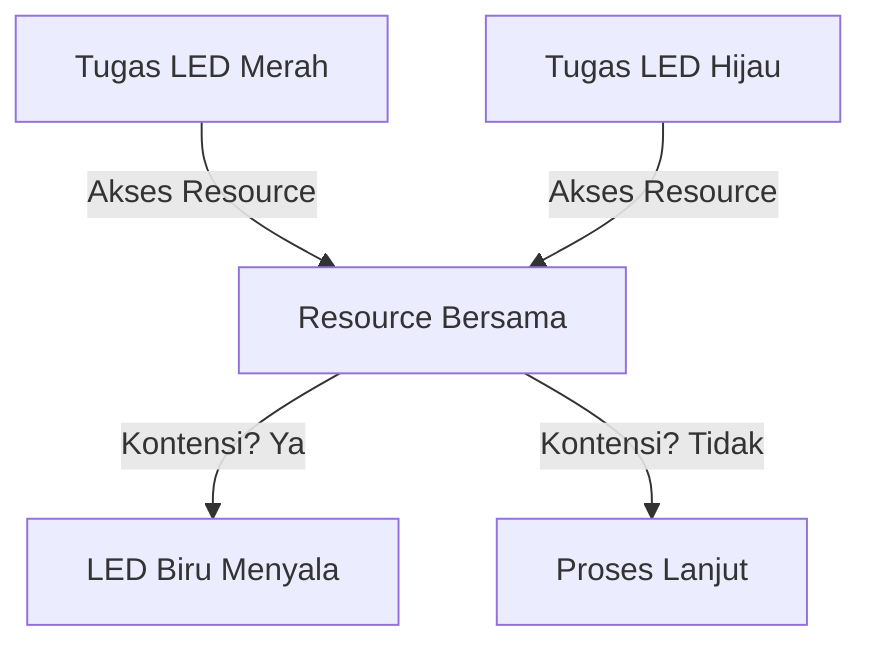

# Demonstrasi Masalah Kontensi Resource dalam Sistem Multitasking

## Gambaran Proyek
Proyek ini menunjukkan masalah kontensi resource yang dapat terjadi ketika dua tugas berbagi resource bersama tanpa kontrol akses dalam sistem multitasking. Masalah ini divisualisasikan melalui LED biru yang menyala saat terdeteksi adanya kontensi.

## Deskripsi Proyek
Dua tugas dirancang untuk mengakses resource bersama berupa variabel `StartFlag`. Resource ini digunakan untuk membaca dan menulis data secara bersamaan. Ketika kontensi terjadi, data bisa korup, dan ini ditandai dengan menyalakan LED biru.

## Tugas
### 1. **Tugas LED Hijau**
   - **Deskripsi**: Menyalakan dan mematikan LED hijau.
   - **Prioritas**: Di bawah Normal.
   - **Langkah**:
     1. Hidupkan LED hijau.
     2. Akses resource bersama.
     3. Matikan LED hijau.
     4. Tunggu selama **500ms**.

### 2. **Tugas LED Merah**
   - **Deskripsi**: Menyalakan dan mematikan LED merah.
   - **Prioritas**: Normal.
   - **Langkah**:
     1. Hidupkan LED merah.
     2. Akses resource bersama.
     3. Matikan LED merah.
     4. Tunggu selama **100ms**.

### 3. **Resource Bersama**
   - **Akses**:
     - Periksa status `StartFlag`.
     - Jika `StartFlag` aktif (1), ubah menjadi tidak aktif (0) dan lanjutkan akses.
     - Jika tidak aktif, nyalakan LED biru untuk menandai kontensi.
   - **Simulasi Operasi**:
     - Simulasi akses resource dilakukan dengan penundaan waktu selama **500ms**.
   - **Reset**:
     - Setelah selesai, setel `StartFlag` kembali ke aktif (1).
     - Matikan LED biru jika menyala.

## Hubungan Antar Tugas
- Tugas LED Hijau dan Merah berbagi resource bersama tanpa mekanisme kontrol akses.
- Kontensi terjadi jika kedua tugas mencoba mengakses resource secara bersamaan.

## Diagram Alur Kerja

##Dokumentasi

## Hasil Perilaku LED
### 1. **Green LED**
   - LED hijau menyala selama 500ms untuk setiap siklus.
   - Pola nyala/mati konsisten saat dijalankan secara individu.

### 2. **Red LED**
   - LED merah menyala selama 100ms untuk setiap siklus.
   - Pola nyala/mati konsisten saat dijalankan secara individu.

### 3. **Blue LED**
   - LED biru menyala ketika kontensi resource terdeteksi (dua tugas mencoba mengakses resource bersama secara bersamaan).
   - Jika kontensi sering terjadi, LED biru menyala berkali-kali, memberikan gambaran kasar tentang frekuensi kontensi.
